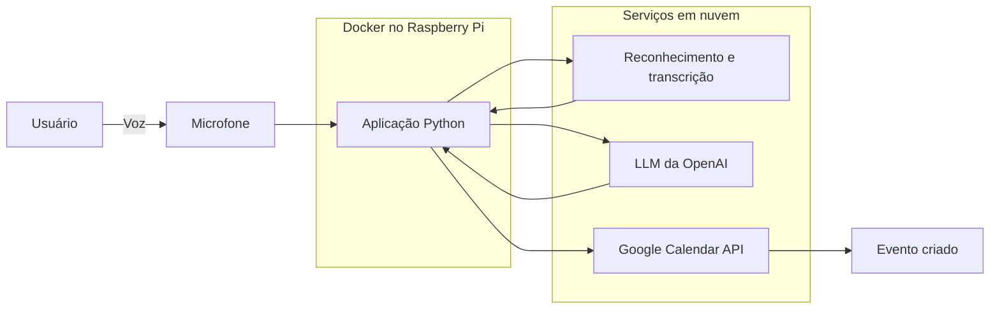

# Bimbo — Assistente virtual por voz no Raspberry Pi

Projeto acadêmico desenvolvido para a disciplina de **Computação Pervasiva**. O objetivo foi criar um assistente virtual acionado por voz, inspirado na experiência de uso da Amazon Alexa, capaz de executar em um **Raspberry Pi 4B** e interpretar comandos em linguagem natural com uma LLM da OpenAI.

Como demonstração prática, o assistente foi integrado ao **Google Calendar**, permitindo transformar um comando falado em um evento na agenda do usuário.

## Visão geral

O Bimbo permanece aguardando sua palavra de ativação. Após ouvir **“Oi, Bimbo”**, ele captura o comando do usuário, transcreve o áudio, interpreta a intenção e executa a ação correspondente no Google Calendar.

Toda a aplicação foi empacotada em um contêiner Docker. Dessa forma, o Raspberry Pi precisa apenas dos periféricos de áudio, do Docker, das credenciais dos serviços e de conexão com a internet para executar o projeto.

> A aplicação e sua orquestração são executadas no Raspberry Pi. A transcrição, a interpretação por LLM e a integração com o calendário utilizam APIs externas e, portanto, dependem de internet.

## Funcionalidades

- Detecção da palavra de ativação **“Oi, Bimbo”**;
- captura de comandos por microfone;
- reconhecimento de fala em português brasileiro;
- transcrição de áudio com a API da OpenAI;
- interpretação de datas, horários e descrições em linguagem natural;
- criação de eventos no Google Calendar;
- autenticação segura no Google por OAuth 2.0;
- execução containerizada no Raspberry Pi com Docker Compose;
- tratamento de ruídos e mensagens do ALSA/PortAudio.

Exemplo de comando:

> “Oi, Bimbo. Marque uma reunião de projeto amanhã às três da tarde por uma hora.”

## Arquitetura



Fluxo resumido:

1. O microfone captura o áudio ambiente.
2. O assistente identifica a palavra de ativação.
3. O comando falado é transcrito para texto.
4. A LLM converte o pedido em dados estruturados, como título, data e horário.
5. Os dados são validados e enviados à API do Google Calendar.
6. O evento é adicionado à agenda do usuário.

## Tecnologias utilizadas

- **Hardware:** Raspberry Pi 4B e microfone USB;
- **linguagem:** Python 3.13;
- **IA e voz:** OpenAI API e SpeechRecognition;
- **integração:** Google Calendar API v3 e OAuth 2.0;
- **áudio:** PyAudio, PortAudio e ALSA;
- **infraestrutura:** Docker e Docker Compose;
- **sistema operacional:** Raspberry Pi OS 64-bit.

## Requisitos

- Raspberry Pi 4B com Raspberry Pi OS 64-bit;
- Docker com o plugin Docker Compose;
- microfone reconhecido pelo sistema em `/dev/snd`;
- projeto configurado no Google Cloud com acesso à API do Google Calendar;
- credenciais OAuth 2.0 do Google;
- chave de API da OpenAI;
- conexão com a internet.

## Configuração

### 1. Prepare as variáveis de ambiente

Crie o arquivo `.env` a partir do exemplo:

```bash
cp .env.example .env
```

Preencha no `.env` as credenciais da OpenAI e do Google:

```dotenv
OPENAI_API_KEY=sua_chave_da_openai
OPENAI_TEXT_MODEL=seu_modelo_de_texto

GOOGLE_CLIENT_ID=seu_client_id
GOOGLE_CLIENT_SECRET=seu_client_secret
GOOGLE_REFRESH_TOKEN=seu_refresh_token
GOOGLE_ACCESS_TOKEN=
```

Nunca publique o arquivo `.env` nem credenciais reais.

### 2. Autorize o Google Calendar

Na primeira autorização, o Google precisa abrir uma página de autenticação no navegador. O caminho mais simples é executar o projeto uma vez em um ambiente com navegador para gerar o `token.json` e, depois, transferir esse arquivo para a raiz do projeto no Raspberry Pi.

O token deve pertencer à mesma aplicação OAuth configurada nas variáveis de ambiente.

### 3. Confirme o microfone

No Raspberry Pi, verifique se o dispositivo de captura foi reconhecido:

```bash
arecord -l
```

O Docker Compose disponibiliza `/dev/snd` ao contêiner para que a aplicação possa acessar o microfone.

## Execução com Docker

Construa a imagem e inicie o assistente:

```bash
docker compose up --build -d
```

Acompanhe a execução:

```bash
docker compose logs -f assistente
```

Para encerrar:

```bash
docker compose down
```

## Segurança e privacidade

- `.env`, `credentials.json`, `token.json` e outros arquivos JSON estão excluídos do versionamento;
- as chaves e os tokens são fornecidos ao contêiner por variáveis de ambiente;
- nunca utilize credenciais reais em exemplos, commits, capturas de tela ou demonstrações públicas;
- revogue imediatamente qualquer chave ou token que tenha sido compartilhado por engano;
- comandos de voz são processados por serviços externos de reconhecimento de fala e pela OpenAI;
- informações de eventos são enviadas ao Google Calendar;
- os logs locais podem conter transcrições e detalhes dos eventos, portanto não devem ser publicados sem revisão.

## Estrutura da branch principal

```text
.
├── main.py                 # Captura de voz e interpretação do comando
├── google_calendar.py      # Autenticação e integração com o Calendar
├── compose.yaml            # Execução do serviço no Raspberry Pi
├── Dockerfile              # Construção da imagem da aplicação
├── requirements.txt        # Dependências Python
└── .env.example            # Modelo das variáveis de ambiente
```

## Contexto acadêmico

O projeto explora conceitos de computação pervasiva ao combinar:

- interação natural e contínua por voz;
- computação embarcada em hardware de baixo custo;
- integração entre dispositivo físico e serviços em nuvem;
- automação contextual de uma tarefa cotidiana;
- implantação reproduzível por meio de contêineres.

## Integrantes

- Gustavo Gomes
- Gustavo Frias
- Vitor Passagem
- Renan Alves

## Status do projeto

Protótipo acadêmico funcional. O projeto foi desenvolvido e validado em um Raspberry Pi 4B, com foco na demonstração dos conceitos estudados na disciplina de Computação Pervasiva.
